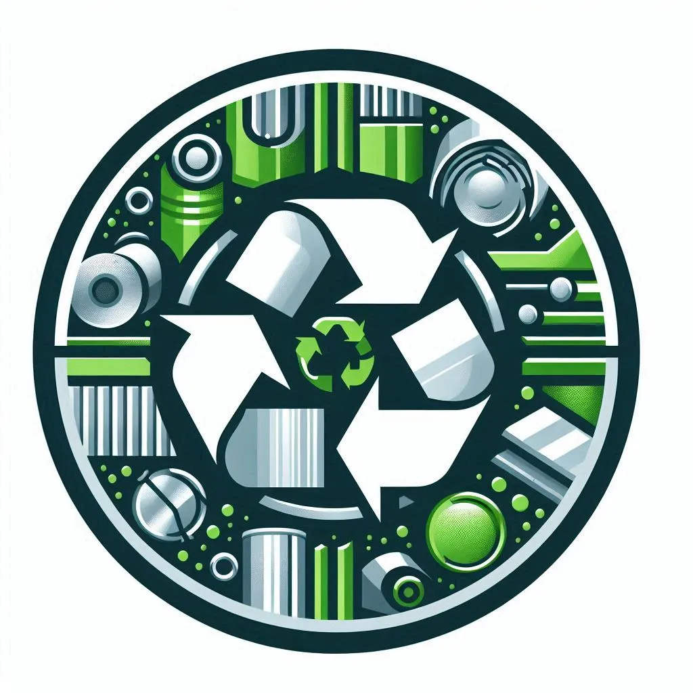

# Simulación de Reciclado de Aluminio

<p align="center">
  
</p>

## Descripción

Proyecto de simulación que demuestra el proceso de reciclaje de aluminio y su impacto positivo en el medio ambiente. Esta aplicación web simula el funcionamiento de la empresa SICAMAR Metales SA, especializada en la recolección, procesamiento y reciclaje de aluminio para la fabricación de productos finales.

A través de este simulador, se pueden visualizar los beneficios ambientales del reciclado de aluminio: por cada tonelada de aluminio reciclado se ahorran 9 toneladas de emisiones de CO2.

## Características

- Simulación del proceso completo de reciclado de aluminio
- Visualización de resultados mediante gráficos interactivos
- Posibilidad de configurar parámetros de la simulación
- Cálculo de toneladas de CO2 ahorradas
- Estimación de producción de componentes finales
- Interfaz responsiva adaptada a diferentes dispositivos

## Tecnologías Utilizadas

- HTML5, CSS3, JavaScript
- SASS para la gestión de estilos
- Gulp para automatización de tareas
- Chart.js para la visualización de datos
- Font Awesome para iconografía
- Google Fonts para tipografía

## Instalación

1. Clonar el repositorio:

   ```
   git clone https://github.com/Juanmartin19l/Simulacion-AluminioReciclado-2024.git
   cd Simulacion-AluminioReciclado-2024
   ```

2. Instalar dependencias:

   ```
   npm install
   ```

3. Iniciar el entorno de desarrollo:
   ```
   npm run dev
   ```
4. Inicia Live Server

## Estructura del Proyecto

```
Simulacion-AluminioReciclado-2024/
├── build/
│   ├── css/        # Estilos compilados
│   └── js/         # JavaScript minificado
├── src/
│   ├── img/        # Imágenes del proyecto
│   ├── js/         # Archivos JavaScript
│   └── scss/       # Archivos SASS
├── video/          # Videos del proyecto
├── index.html      # Página principal
├── procesoSimulacion.html  # Página de simulación
├── gulpfile.js     # Configuración de Gulp
└── package.json    # Dependencias del proyecto
```

## Proceso de Simulación

La simulación contempla los siguientes pasos:

1. **Recolección**: Entrada diaria de camiones con chatarra (20-30 toneladas por camión)
2. **Clasificación**: Separación de aluminio reciclable (45%-75% del total)
3. **Procesamiento**: Clasificación del aluminio en tres calidades:
   - Aluminio99 (10%): Para componentes automotrices
   - Aluminio80 (40%): Para utensilios de cocina
   - Aluminio50 (50%): Para componentes industriales
4. **Producción**: Transformación del aluminio en productos finales
5. **Resultados**: Visualización del ahorro de CO2 y producción total

## Equipo de Desarrollo

Estudiantes de 4° año de Ingeniería en Sistemas de Información - UTN FRT:

- Lavalle, Juan Martín
- Llobeta, Juan Lucas
- Mansilla, Joel Armando
- Vaca, Daniel Agustín

## Materia

Trabajo Final Integrador - Simulación 4K1 2024

## Licencia

Este proyecto es desarrollado con fines académicos. Todos los derechos reservados.

## Contacto

Desarrollado por [Juan Martín Lavalle](https://github.com/Juanmartin19l) | [LinkedIn](https://www.linkedin.com/in/juan-mart%C3%ADn-lavalle/)
